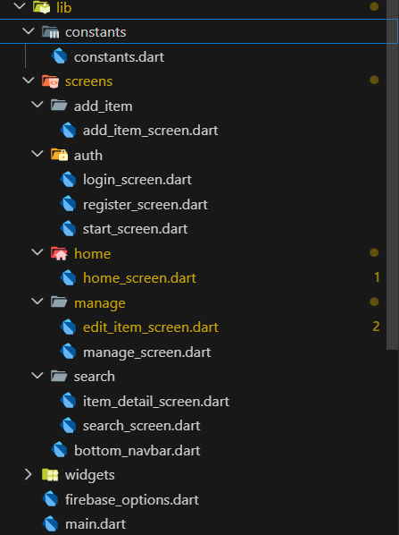
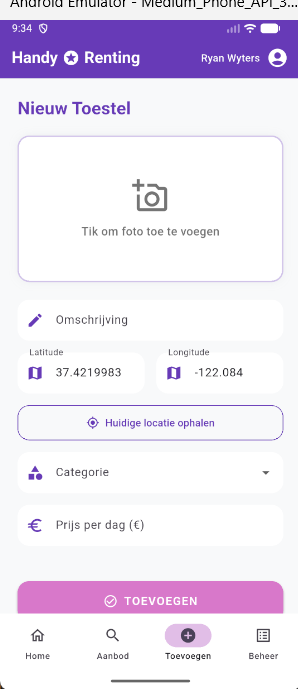
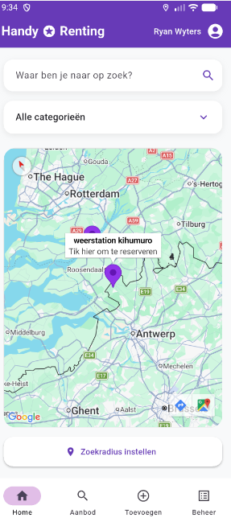

# Verslag Project HandyRenting: Van Monoliet naar Moderne App

In dit verslag vatten we de recente updates aan de HandyRenting-app samen. De focus lag op het verbeteren van de code-architectuur en het toevoegen van slimme locatiefunctionaliteiten.

## 1. Opsplitsing en Structuur

Om de code onderhoudbaar te houden, hebben we het grote `main.dart` bestand opgesplitst in een overzichtelijke mappenstructuur. We werken nu met een **feature-first** indeling:

- **Constants:** Voor algemene instellingen zoals categorieën.
- **Widgets:** Herbruikbare UI-elementen (knoppen, tekstvelden).
- **Screens:** Elk scherm (Home, Zoeken, Toevoegen, Beheer) heeft nu zijn eigen bestand en logica.

## 2. Geolocatie bij Items

De manier waarop locaties worden opgeslagen is volledig vernieuwd. Waar voorheen simpelweg een plaatsnaam als tekst werd ingevuld, gebruiken we nu **geolocatie (Latitude en Longitude)**.

- **Huidige Locatie:** Bij het toevoegen van een item kan de verhuurder nu met één druk op de knop de exacte GPS-locatie van de telefoon ophalen.
- **Data-opslag:** In Firebase worden deze gegevens nu opgeslagen als een `GeoPoint`, wat essentieel is voor kaartintegraties.

## 3. Interactieve Kaart met Filters

De meest opvallende toevoeging is de interactieve kaart op het `HomeScreen`. In plaats van een statische lijst, ziet de gebruiker nu direct waar items zich bevinden.

- **Live Markers:** De kaart toont paarse 'stipjes' (markers) voor elk beschikbaar toestel.
- **Filtering:** De markers reageren direct op de categorie-dropdown. Filter je op 'Tuin'? Dan zie je alleen tuinonderhoud in de buurt.
- **Reserveren:** Door op een stip te klikken verschijnt de naam van het toestel. Een klik op de info-popup stuurt de gebruiker direct naar de detailpagina om de reservatie te voltooien.

---
